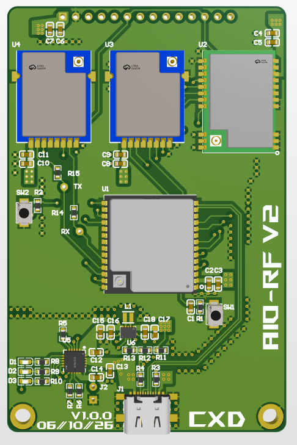
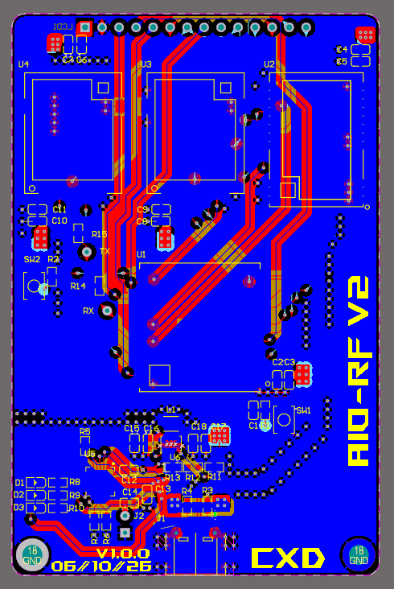
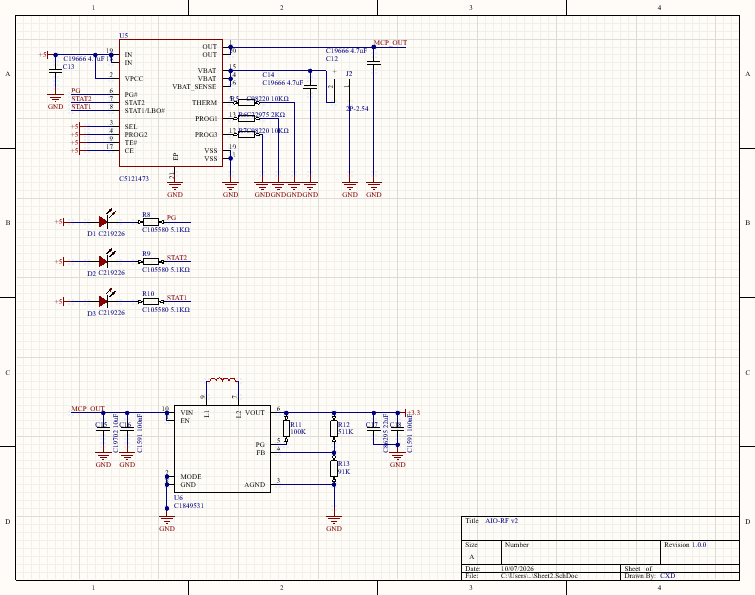
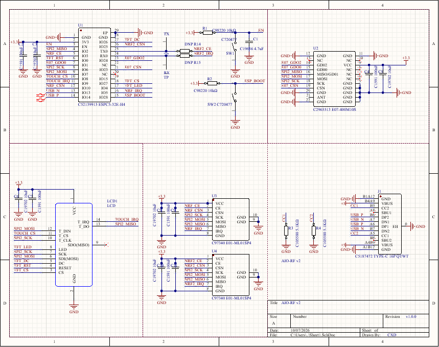
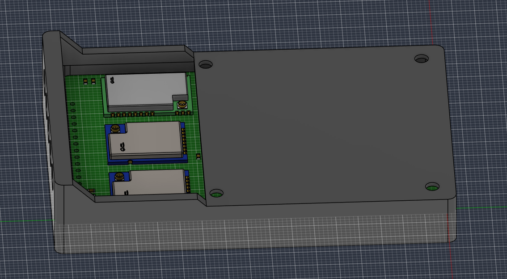

# AIO-RF-v2
An all-in-one RF platform built around the ESP32 C5, combining 2.4ghz + 5ghz Wi-Fi, Bluetooth, and sub-GHz RF into a single battery-powered device with a 2.8" LCD display and USB Type-C charging and battery integration.  

Connect via USB Type-C to flash firmware via your preferred flashing software through the USBC port, or choose to flash directly through the exposed tx and rx pins (before jumping connection to the modules. The MCP73871 handles battery charging path. Warning that the onboard battery controller does not have a cut-off threshold, a protected battery must be used. Refer to charging controller MCP73871-2CCI/ML for appropriate battery specifications. A battery is not required, it can be powered directly through USB-C.  

**Why**  
This device consolidates many features and a wide range of protocols and frequencies into one clean, portable device for wireless experimentation and IoT development.  
PCB  

Schematic  

Housing  

  
**Bill of Materials**  
| Value | Description | Designator | Quantity | Part # | Purchase Link |
| :--- | :--- | :--- | :--- | :--- | :--- |
| 100nF | 100nF (104) ±10% 50V | C2, C4, C7,... | 5 | C1591 | https://www.lcsc.com/product-detail/C1591.html |
| 4.7uF | 4.7uF (475) ±10% 16V | C1 | 1 | C19666 | https://www.lcsc.com/product-detail/C19666.html |
| 10uF | 10uF (106) | C3, C5, C6,... | 5 | C19702 | https://www.lcsc.com/product-detail/C19702.html |
| E01-ML01SP4 | 2.4GHz Wireless Module | U3, U4 | 2 | C97340 | https://www.lcsc.com/product-detail/C97340.html |
| 10kΩ | Resistor 10kΩ | R1, R2 | 2 | C98220 | https://www.lcsc.com/product-detail/C98220.html |
| 5.1kΩ | Resistor 5.1kΩ | R3, R4 | 2 | C105580 | https://www.lcsc.com/product-detail/C105580.html |
| TS-1088-AR02016 | Tactile Switch SPST | SW1, SW2 | 2 | C720477 | https://www.lcsc.com/product-detail/C720477.html |
| E07-400M10S | CC1101 Wireless Module | U2 | 1 | C2965513 | https://www.lcsc.com/product-detail/C2965513.html |
| TYPE-C 16P QTWT | USB Type-C 16-Pin Receptacle | J1 | 1 | C5187472 | https://www.lcsc.com/product-detail/C5187472.html |
| ESPC5-32E-H4 | ESP32-C5 Wireless Module | U1 | 1 | C52139915 | https://www.lcsc.com/product-detail/C52139915.html |
| LCD | 2.8" SPI Touch Display | LCD1 | 1 | — | https://aliexpress.com/item/1005010008924503.html? |
  

**Changelog**  

